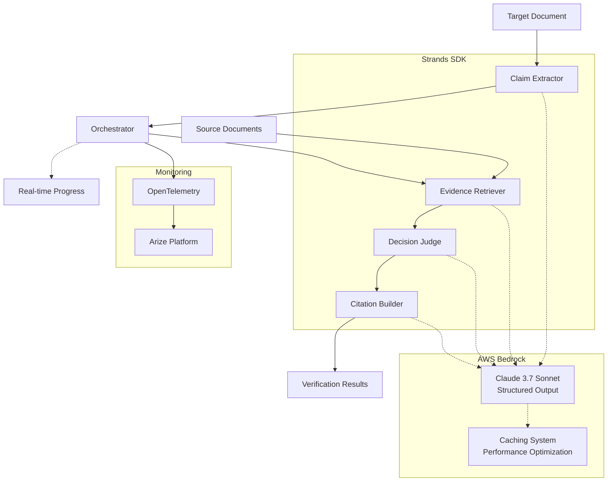
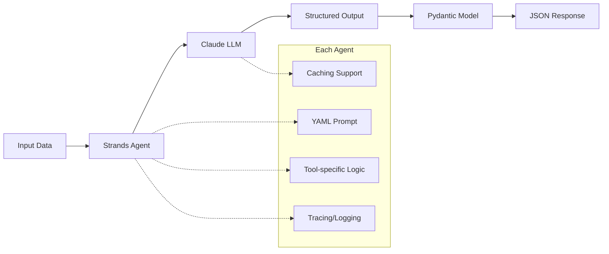

<div align="center">
  <h1><strong>Strands Document Verification System</strong></h1>
  <h2>Multi-Agent Document Verification using Strands SDK and AWS Bedrock</h2>
  <div>
    <a href="https://pypi.org/project/strands-agents/">
      
    </a>
    <a href="https://pypi.org/project/boto3/">
      
    </a>
  </div>
</div>
## Overview

This PoC demonstrates automated document verification using specialized AI agents:

## System Architecture

### Multi-Agent Workflow


### Core Agents

#### 1. Claim Extractor
**Role**: Automatically identify verifiable claims from the target document
```python
# Input: Target document text
# Output: Structured list of claims
{
  "claims": [
    {
      "claim_id": "C001",
      "claim_text": "Operating temperature must be -40°C to 85°C",
      "category": "Temperature Requirements",
      "target_locator": {"section": "1.2", "line": 11}
    }
  ]
}
```

#### 2. Evidence Retriever
**Role**: Intelligent search for evidence related to claims in source documents
```python
# Input: Claim text + source documents
# Output: List of relevant evidence
{
  "evidence": [
    {
      "evidence_id": "E001",
      "evidence_text": "Operating temperature range: -40°C to 80°C",
      "source_document": "rfp-a123-v5.txt",
      "relationship": "contradicts",
      "relevance_score": 0.95
    }
  ]
}
```

#### 3. Decision Judge
**Role**: Determine the truthfulness of claims based on evidence
```python
# Input: Claim + list of evidence
# Output: Judgment result
{
  "verdict": "CONTRADICTED",  # SUPPORTED|CONTRADICTED|PARTIAL|NOT_FOUND
  "confidence": 95,           # Score 0-100
  "rationale": "The claim states the maximum temperature is 85°C, but the source document specifies 80°C, indicating a contradiction.",
  "supporting_evidence": [],
  "contradicting_evidence": ["E001"]
}
```

#### 4. Citation Builder
**Role**: Automatically generate standardized source citations
```python
# Input: List of evidence + source metadata
# Output: List of citations
{
  "citations": [
    {
      "docId": "rfp-a123-v5.txt",
      "version": "5",
      "page": "1",
      "section": "1.2",
      "citation_text": "RFP v5 p1 §1.2"
    }
  ]
}
```

#### 5. Orchestrator
**Role**: Coordinate the entire verification pipeline and real-time monitoring
- Manage data flow between agents
- Display real-time progress on CLI
- Collect and report performance metrics
- Handle errors and recovery

### Key Features

- Support for TXT file input (UTF-8 encoding)
- Multi-agent analysis based on Strands SDK
- Integrated tracing and monitoring with OpenTelemetry and Arize
- Structured JSON output including citations
- Easy-to-use CLI interface
- Real-time progress display with color-coded results
- Performance optimization with caching support

## Quick Start

1. **Initialize Project**
   ```bash
   python main.py init
   ```

2. **Add Documents**
   - Place source documents (TXT) in the `source/` directory
   - Place target documents (TXT) in the `target/` directory

3. **Configure Environment**
   - Set AWS credentials for AWS Bedrock access
   - Configure Arize credentials (optional)

4. **Run Verification**
   ```bash
   python main.py verify
   ```

## Configuration

Create a `.env` file or set environment variables:

```bash
AWS_PROFILE=default
AWS_REGION=us-west-2
ARIZE_SPACE_ID=your-space-id
ARIZE_API_KEY=your-api-key
```

## CLI Usage

```bash
# Basic verification
python main.py verify

# Custom directories
python main.py verify --source-dir ./my-sources --target-dir ./my-target

# Custom session ID
python main.py verify --session-id my-verification-001

# Verbose output
python main.py verify --verbose

# View result table
python main.py view-table ./results/sess-2025-09-24-abc123.json

# Run benchmark (cache vs no-cache performance)
python benchmark.py
```

## Output Results

### CLI Progress Display
```
┌──────────────────────── DOCUMENT VERIFICATION SYSTEM ────────────────────────┐
│ Session ID: sess-2025-09-24-51e5fa15                                           │
│ Model: us.anthropic.claude-3-7-sonnet-20250219-v1:0                            │
│ Caching: ENABLED                                                               │
│                                                                                │
│ Multi-Agent Analysis Pipeline Ready...                                         │
└────────────────────────────────────────────────────────────────────────────────┘

╔════════════════════════════════════════════════════════════════════════════════╗
║ CLAIM 1/15: C001                                                                ║
║ The monthly communication fee is 76,000 KRW (usage for June 2025).              ║
╚════════════════════════════════════════════════════════════════════════════════╝

  Evidence Retrieval
  [SUCCESS] Evidence Search: 2 pieces found

  Decision Analysis
  [SUCCESS] Verdict: CONTRADICTED
  [SUCCESS] Confidence: 95%

  Citation Generation
  [SUCCESS] Citations: 2 generated

  Final Result:
    [CONTRADICTED] 95% confidence
```

### JSON Output Structure
Results are saved as JSON files in the `results/` directory:

```json
{
  "document_id": "sess-2025-09-24-001",
  "title": "Document Verification Report",
  "blocks": [
    {
      "block_id": "block-01",
      "title": "Block: Fee Information",
      "claims": [
        {
          "claim_id": "C001",
          "title": "Claim: The monthly communication fee is 76,000 KRW",
          "details": {
            "verdict": "SUPPORTED|CONTRADICTED|PARTIAL|NOT_FOUND",
            "confidence": 95,
            "rationale": "Detailed judgment rationale...",
            "citations": [
              {
                "docId": "rfp-a123-v5.txt",
                "version": "1",
                "page": "1"
              }
            ]
          }
        }
      ]
    }
  ],
  "performance": {
    "total_time_seconds": 45.2,
    "claims_processed": 15,
    "avg_time_per_claim": 3.01,
    "caching_enabled": true
  }
}
```

### Table View Output
```bash
python main.py view-table ./results/sess-2025-09-24-abc123.json
```

```
====================================================================================================
ID       Block/Claim                              Status          Dependencies
====================================================================================================
BLOCK-01 Fee Information                           -               -
  C001   └─ The monthly communication fee is 76,000 KRW Fail            RFP v5 p1, RFP v5 p1
  C002   └─ The billing period is 2025.06.01        Fail            RFP v5 p1, RFP v5 p1
----------------------------------------------------------------------------------------------------
BLOCK-02 Payment Method                            -               -
  C003   └─ The payment method is automatic card payment Pass           RFP v5 p1, RFP v5 p1

SUMMARY STATISTICS:
  Total Claims: 15
  Pass (Supported): 8
  Fail (Contradicted): 5
  Partial: 1
  Not Found: 1
  Overall Pass Rate: 60.0%
```

## Development Information

### Agent Implementation Details

#### Common Architecture Pattern


#### Claim Extractor - `claim_extractor.py`
**Tech Stack**: Strands Agent + ClaimsExtractionResult model
```python
class ClaimsExtractionResult(BaseModel):
    claims: List[ClaimExtraction] = Field(description="Extracted claims")

class ClaimExtraction(BaseModel):
    claim_id: str = Field(description="Unique claim ID")
    claim_text: str = Field(description="Claim text")
    category: str = Field(description="Claim category")
    confidence: float = Field(description="Extraction confidence")
```

**Key Features**:
- Automatically identify verifiable claims from text
- Convert requirements, specifications, and conditional statements into structured claims
- Categorize by type (temperature, voltage, size, etc.)
- Optimized for mixed Korean/English text processing

#### Evidence Retriever - `evidence_retriever.py`
**Tech Stack**: Message caching + EvidenceRetrievalResult model
```python
class EvidenceRetrievalResult(BaseModel):
    evidence: List[Evidence] = Field(description="Found evidence")

class Evidence(BaseModel):
    evidence_id: str = Field(description="Evidence ID")
    evidence_text: str = Field(description="Evidence text")
    source_document: str = Field(description="Source document")
    relationship: str = Field(description="supports|contradicts|partial")
    relevance_score: float = Field(description="Relevance score")
```

**Key Features**:
- Semantic similarity based evidence search
- Parallel search across multiple source documents
- Relationship classification: support/contradict/partial
- Relevance scoring and ranking

#### Decision Judge - `decision_judge.py`
**Tech Stack**: Structured output + DecisionJudgmentResult model
```python
class DecisionJudgmentResult(BaseModel):
    verdict: str = Field(description="SUPPORTED|CONTRADICTED|PARTIAL|NOT_FOUND")
    confidence: int = Field(description="0-100 confidence", ge=0, le=100)
    rationale: str = Field(description="Judgment rationale - required field")
    supporting_evidence: List[str] = Field(description="Supporting evidence IDs")
    contradicting_evidence: List[str] = Field(description="Contradicting evidence IDs")
```

**Judgment Logic**:
- **SUPPORTED**: Evidence clearly supports the claim
- **CONTRADICTED**: Evidence directly contradicts the claim
- **PARTIAL**: Similar but details differ
- **NOT_FOUND**: No relevant evidence found

**Confidence Guidelines**:
- 90-100: Very strong evidence with clear support/contradiction
- 70-89: Strong evidence with good match
- 50-69: Moderate evidence with partial match
- 30-49: Weak evidence with limited match
- 0-29: Very weak or unclear evidence

#### Citation Builder - `citation_builder.py`
**Tech Stack**: CitationBuildingResult model + metadata handling
```python
class CitationBuildingResult(BaseModel):
    citations: List[Citation] = Field(description="Generated citations")

class Citation(BaseModel):
    docId: str = Field(description="Document ID")
    version: str = Field(description="Version")
    page: str = Field(description="Page")
    section: Optional[str] = Field(description="Section")
    citation_text: str = Field(description="Standardized citation text")
```

**Standard Formats**:
- `RFP v5 p1 §1.2` - Document + version + page + section
- `Internal Spec v2 p3` - Internal document format
- Generate traceable reference links

#### Orchestrator - `orchestrator.py`
**Role**: Manage the entire workflow
```python
def verify_document(self, session_id: str = None) -> str:
    # 1. Load documents
    target_file, target_content = self.load_target_document()
    source_documents = self.load_source_documents()

    # 2. Extract claims
    claims_result = self.claim_extractor(target_file, target_content)

    # 3. Verify each claim
    for claim in claims:
        # Retrieve evidence
        evidence = self.evidence_retriever(claim_text, source_docs)
        # Make judgment
        judgment = self.decision_judge(claim_text, evidence)
        # Generate citations
        citations = self.citation_builder(evidence, metadata)

    # 4. Aggregate and save results
    return self.save_results(verified_claims)
```

**Performance Optimization**:
- Use AWS Bedrock caching
- Support parallel processing
- Efficient handling of large documents
- Real-time progress display

### Project Structure
```
src/
├── agents/          # Specialized agent implementations
│   ├── claim_extractor.py
│   ├── evidence_retriever.py
│   ├── decision_judge.py
│   └── citation_builder.py
├── prompts/         # YAML prompt templates
│   ├── claim_extractor.yaml
│   ├── evidence_retriever.yaml
│   ├── decision_judge.yaml
│   └── citation_builder.yaml
├── config.py        # Configuration management
├── models.py        # Pydantic data models
├── orchestrator.py  # Main orchestration logic
├── table_viewer.py  # Result table viewer
├── telemetry.py     # OpenTelemetry setup
└── utils.py         # Utility functions
```

## Requirements

- Python 3.12+
- AWS Bedrock access permissions
- Strands SDK
- Dependencies listed in requirements.txt

## Environment Setup (uv)

We recommend using [uv](https://github.com/astral-sh/uv) for fast dependency management and isolated environments.

### Install uv
```bash
pip install uv
# or
brew install uv
```

### Create a virtual environment and install dependencies
```bash
uv venv
source .venv/bin/activate
uv pip install -r requirements.txt
```

### Run the application
```bash
python main.py verify
```

### Supported Models
- Claude 3.7 Sonnet
- Other AWS Bedrock supported models